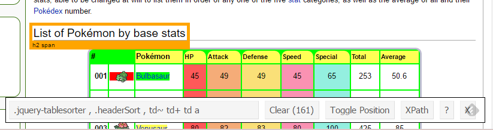
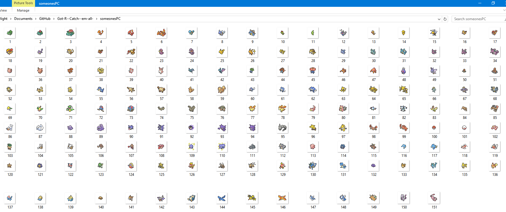

# Objective {data-background="images/pokemon_pokeball_by_mr_droy.png"}

## 3 Web scraping methods {data-background="images/pokemon_pokeball_by_mr_droy.png"}

* We're gonna' do 3 different web scraping tasks in 5 minutes from a single site
1. Scrape a table of original 151 Pokemon stats from one webpage
2. Scrape 151 images of Pokemon from separate 151 webpages
3. Build a plot that scrapes the .pngs of each Pokemon from 151 webpages **by itself**

# Pokeball - Rvest Table Scraping {data-background="images/pokemon_pokeball_by_mr_droy.png"}

## Pluck the data from Bulbapedia {data-background="images/pokemon_pokeball_by_mr_droy.png"}


## Libraries and Data {data-background="images/pokemon_pokeball_by_mr_droy.png"}

```{r message=FALSE, warning=FALSE}
library(tidyverse)
library(rvest)
library(stringr)

bulbagarden <- "http://bulbapedia.bulbagarden.net/wiki/List_of_Pok%C3%A9mon_by_base_stats_(Generation_I)"
```

## PokedexR {data-background="images/pokemon_pokeball_by_mr_droy.png"}

```{r}
baseStats <-
  # Read HTML or XML
  xml2::read_html( 
    x = bulbagarden
    ) %>% # This is a pipe operator from magrittr
  # Extract pieces out of HTML using css selectors
  rvest::html_node(
    # rvest recommends using 'Selector Gadget'
    css = "div table" 
    ) %>%
  # Parse an html table into a data frame
  rvest::html_table() 
```

## SelectorGadget (like a silph scope but for web pages) {data-background="images/pokemon_pokeball_by_mr_droy.png"}

* `rvest` recommends [SelectorGadget](http://selectorgadget.com/) is a chrome extension for CSS selector generation. 
* It "Makes the Invisible Plain to See!" by exposing which parts of the html correspond to which bits of the user facing webpage.

* However, I had to fudge it a bit, as it didn't pick up the table properly.

## All the data {data-background="images/pokemon_pokeball_by_mr_droy.png"}

```{r}
head(baseStats, n = 3)
```

## Muky Data {data-background="images/mukwave.jpg"}

```{r}
baseStats %>% 
  select(-2) %>% 
  rename(DexNo = `#`, 
         Pokemon = !!names(.[2])) -> baseStats
```

# Greatball - Rvest image scraping {data-background="images/pokemon_greatball_by_mr_droy.png"}

## Grab all 151 images {data-background="images/pokemon_greatball_by_mr_droy.png"}

```{r}
get_img_url <- function(x, url = bulbagarden) {
  read_html(url) %>%
    html_nodes(css = "#mw-content-text img") %>%
    str_split_fixed("src=\"", n = 2) %>%
    .[, 2] %>%
    str_split_fixed("\" width=", n = 2) %>%
    .[, 1] %>%
    paste0("https:", .)
}

baseStats %>% 
  mutate(
    img_url = get_img_url(Pokemon)
    ) -> baseStats
```

## Congratulations, you caught all 151 image urls! {data-background="images/pokemon_greatball_by_mr_droy.png"}

```{r}
head(baseStats, n = 3)
```

## Your Pokemon have been moved to "Someones PC"! {data-background="images/pokemon_greatball_by_mr_droy.png"}

```{r eval=FALSE}
dir.create("./someonesPC/")

for(url in baseStats$img_url) {
  download.file(
    url,
    destfile = paste0("./someonesPC/",
                      baseStats[baseStats$img_url == url,]$DexNo,
                      ".png"), 
    mode = "wb"
    )
}
```

## DaveRGP checked "Someones PC"! {data-background="images/pokemon_greatball_by_mr_droy.png"}



# Masterballin' - Rbokeh URL plotting {data-background="images/pokemon_master_ball_by_mr_droy.png"}

## I'm gonna be the very best... {data-background="images/pokemon_master_ball_by_mr_droy.png"}

```{r}
library(rbokeh)

P <- figure() %>% 
  # layer to get .png from url as points
  ly_image_url(
    data = baseStats,
    x = DexNo,
    y = Total,
    w = 10,
    h = 20,
    image_url = img_url,
    anchor = "center"
  )
```

## ...like no one ever was! {data-background="images/pokemon_master_ball_by_mr_droy.png"}

```{r echo = FALSE}
P
```

# Trainer Tips

## Pokemon Programmers can...

* Write R functions
* Write base R for loops
* Use `xml2::read_html()` to read the whole page into memory
    + Use `rvest::html_node()` to find individual parts of the page
    + Use `rvest::html_nodeS()` to return multiple items
* Return a data.frame with `rvest::html_table()`
* Use `stringr` for manipulating urls
* `rbokeh` is an interactive graphics package with an argument for using urls to source .png icons

# Trainer Card

## David Parr

github: [DaveRGP](https://github.com/DaveRGP)

twitter: @biomimicron

website: [davergp.github.io](davergp.github.io)

Pokemon Field Studies: [davergp.github.io/Pokemon_FieldStudies/](http://davergp.github.io/Pokemon_FieldStudies/) 