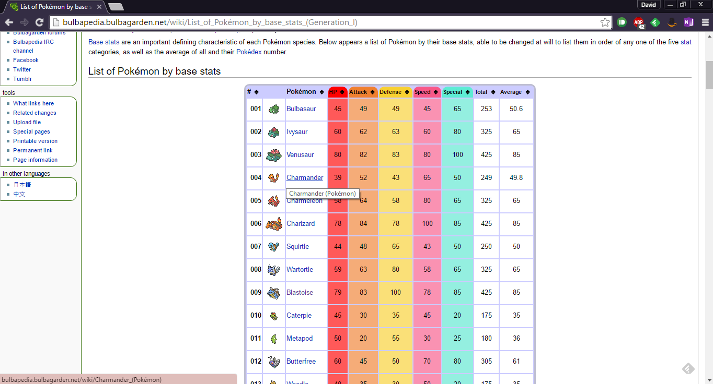

# 3 steps

* We're gonna' do 3 different web scraping tasks in 5 minutes from a single site
1. Scrape a table of original 151 pokemon stats from one webpage
2. Scrape 151 images of pokemon from seperate 151 webpages
3. Build a plot that scrapes the .pngs of each pokemon from 151 webpages **by itself**

# Pluck the data from Bulbapedia {data-background="images/Pluck_IV.png"}

* Bulbapedia is a community website with tonnes of info on every pokemon
  + http://bulbapedia.bulbagarden.net/wiki/List_of_Pok%C3%A9mon_by_base_stats_(Generation_I)


# PokedexR {data-background="images/rotomdex.jpg"}

```{r}
library(rvest)
library(magrittr)

bulbagarden <- "http://bulbapedia.bulbagarden.net/wiki/List_of_Pok%C3%A9mon_by_base_stats_(Generation_I)"
baseStats <-
  # Read HTML or XML
  xml2::read_html( 
    x = bulbagarden
    ) %>% # This is a pipe operator from magrittr
  # Extract pieces out of HTML using css selectors
  rvest::html_node(
    # rvest recommends using 'Selector Gadget'
    css = "div table" 
    ) %>%
  # Parse an html table into a data frame
  rvest::html_table() 
```

# SelectorGadget (like a silph scope but for web pages) {data-background="images/Silph_Scope_Marowak_PO.png"}

* `rvest` recommends [SelectorGadget](http://selectorgadget.com/) is a chrome extension for CSS selector generation. 
* It "Makes the Invisible Plain to See!" by exposing which parts of the html correspond to which bits of the user facing webpage.

* However, I had to fudge it a bit, as it didn't pick up the table properly.

# All the data {data-background="images/rotomdex.jpg"}

```{r}
head(baseStats)
```

# Muky Data {data-background="images/mukwave.jpg"}

```{r}
library(data.table)

baseStats <- data.table::as.data.table(baseStats)

# Remove second col with only "NA"
baseStats[, "" := NULL]
# Rename cols 1 and 2 to something workable
data.table::setnames(baseStats, 
                     1:2, 
                     c("DexNo", "Pokemon"))
```

# Master Ballin' {data-background="images/master-ball-590x262.jpg"}

```{r}
library(stringr)

baseStats[, imgURL := read_html(
    x = bulbagarden# set x to be bulbagarden url
    ) %>% 
  rvest::html_nodes(
    # css to identify EVWERY string for pokemon image urls
    css = "#mw-content-text img"
    ) %>% # split string at point
  stringr::str_split_fixed(
    "src=\"", 
    n = 2
    ) %>% # use second part of string
    .[,2] %>% # split string at point again
  stringr::str_split_fixed(
    "\" width=", 
    n = 2) %>% # use first part of string
    .[,1]]
```

# Congratulations, you caught all 151 image urls! {data-background="images/everypokemon.jpg"}

```{r}
head(baseStats)
```

# Your Pokemon have been moved to "Someones PC"! {data-background="images/someonesPC.png"}

```{r eval=FALSE}
dir.create("./someonesPC/")

# Use for loop as data.table only 
# returns last item if this is run within DT function
for(pkmn in baseStats[, DexNo]){
  download.file(baseStats[pkmn == DexNo, 
                          imgURL], 
                destfile = paste0("./someonesPC/", 
                                  pkmn, ".png"),
                # Makes this work for windows
                mode = "wb") 
}
```

# DaveRGP checked "Someones PC"! {data-background="images/someonesPC.png"}


# I'm gonna be the very best...

```{r}
library(rbokeh)

P <- figure() %>% 
  # layer to get .png from url as points
  ly_image_url(
    data = baseStats,
    x = DexNo,
    y = Total,
    w = 10,
    h = 20,
    image_url = imgURL
  )
```

# ...like no one ever was!

```{r eval = FALSE}
P
```


# Trainer Tips

* Use `xml2::read_html()` to read the whole page into memory
* Use `rvest::html_node()` to find individual parts of the page
+ Use `rvest::html_nodeS()` to return multiple items
* Return a data.frame with `rvest::html_table()`
* `data.table` can be finickity about making connections
+ using for loops might solve that
* Use `stringr` for manipulating urls
* `rbokeh` is an interactive graphics package with an argument for using urls to source .png icons

# Trainer Card

David Parr

github: [DaveRGP](https://github.com/DaveRGP)

twitter: @biomimicron

website: [davergp.github.io](davergp.github.io)

Pokemon Field Studies: [davergp.github.io/Pokemon_FieldStudies/](http://davergp.github.io/Pokemon_FieldStudies/) 